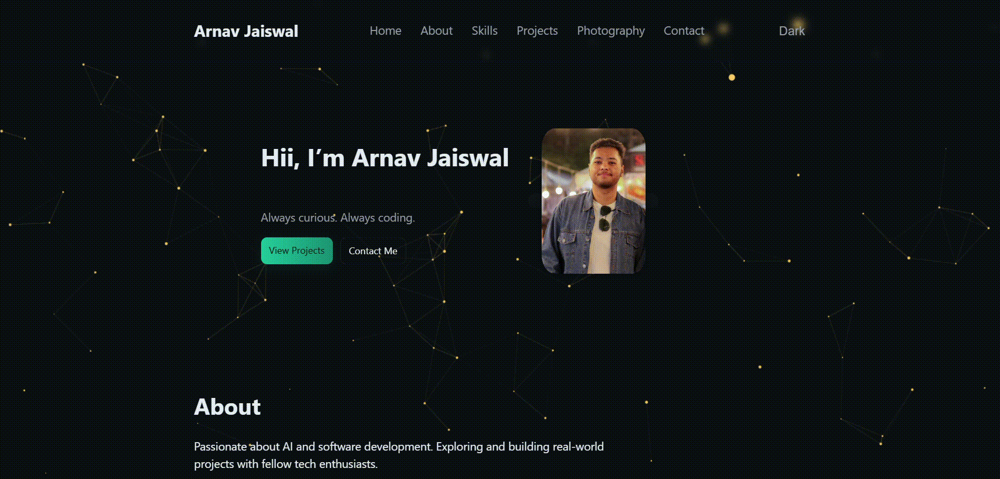

# Arnav Jaiswal — Portfolio

> Personal portfolio website showcasing my projects, skills, photography, and achievements.

<p align="center">
  <a href="https://ar9av.netlify.app">
    
  </a>
  
  
  
</p>

<p align="center">
  <a href="https://ar9av.netlify.app">
    
  </a>
</p>

<p align="center">
  <b>🔗 Live demo &rarr; <a href="https://ar9av.netlify.app">ar9av.netlify.app</a></b>
</p>

---

## ✨ Features

- **Animated hero** with typewriter effect and a particle-canvas background
- **Dark / Light theme** toggle with `localStorage` persistence
- **Projects** section with tech-stack tags and live/GitHub links
- **Photography** gallery with a lightbox viewer
- **Achievements & Certifications** showcase
- **Contact form** powered by Google Apps Script (no backend required)
- Smooth scroll-reveal animations and 3D hover effects
- Fully responsive across desktop, tablet, and mobile

## 🛠 Tech Stack

| Layer        | Tools                          |
| ------------ | ------------------------------ |
| Markup       | HTML5                          |
| Styling      | CSS3 (custom, no frameworks)   |
| Scripting    | Vanilla JavaScript             |
| Form backend | Google Apps Script             |
| Hosting      | Netlify                        |

## 🚀 Projects

| Project | About | Stack | Links |
| ------- | ----- | ----- | ----- |
| **EduBot** | AI-powered adaptive quiz system that personalizes every question in real time and surfaces weak spots. | Flask · Python · MySQL · Botpress · NLP | [Live](https://edubot-y4sk.onrender.com/auth/login) · [Code](https://github.com/SofDev007/EduBot) |
| **Code Escape Room** | Interactive coding-puzzle game with progressive challenges, hints, and real-time progression. | HTML · CSS · JS · PHP · MySQL · NVIDIA NIM | [Live](https://code-escape-room-kk9h.onrender.com/) · [Code](https://github.com/SofDev007/Code-Escape-Room) |
| **RapidReport** | Web-based crime-reporting and awareness platform with SQL-backed report management and admin controls. | HTML · CSS · JS · SQL · WordPress | [Live](https://rapidreport-dc5l.onrender.com/) · [Code](https://github.com/SofDev007/RapidReport) |
| **TruthLens AI** | Misinformation & deepfake detection across text, image, video, and URLs with Explainable AI. | FastAPI · Python · OpenCV · SQLite · AI/ML | [Code](https://github.com/SofDev007/Truth-Lens-AI) |

## 📂 Project Structure

```text
Portfolio/
├── index.html          # Main page
├── style/
│   └── style.css       # All styles
├── js/
│   └── script.js       # Interactions, particles, lightbox, form
└── assets/             # Images, resume PDF, favicon, preview gif
```

## 💻 Running Locally

No build step needed — it's a static site.

```bash
# clone
git clone https://github.com/SofDev007/Portfolio.git
cd Portfolio

# Option 1: open directly
start index.html     # Windows
open index.html      # macOS

# Option 2: serve locally (any static server)
npx serve .
```

## 📫 Contact

- Email: [arnavjaiswal.aj@gmail.com](mailto:arnavjaiswal.aj@gmail.com)
- LinkedIn: [arnav-jaiswal-b12460363](https://www.linkedin.com/in/arnav-jaiswal-b12460363)
- Instagram: [@jaiswal.ar9av](https://www.instagram.com/jaiswal.ar9av/)
- GitHub: [@SofDev007](https://github.com/SofDev007)

---

<p align="center">© 2026 Arnav Jaiswal</p>
